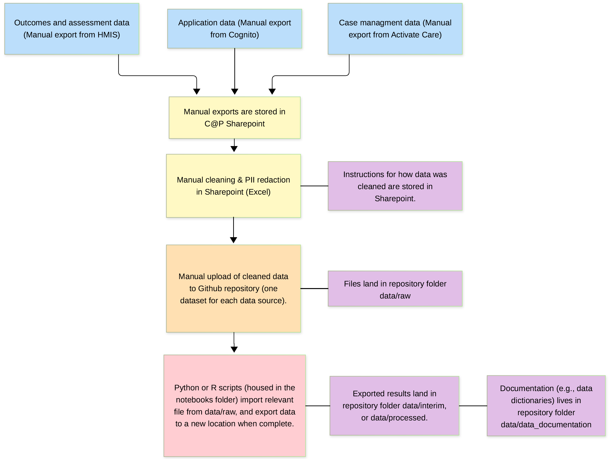
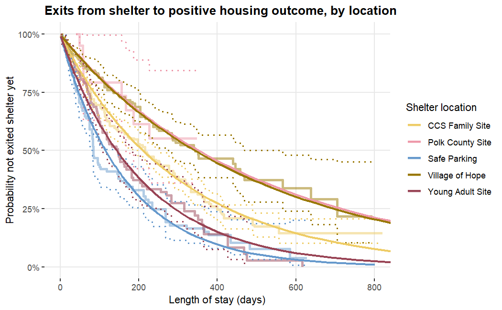
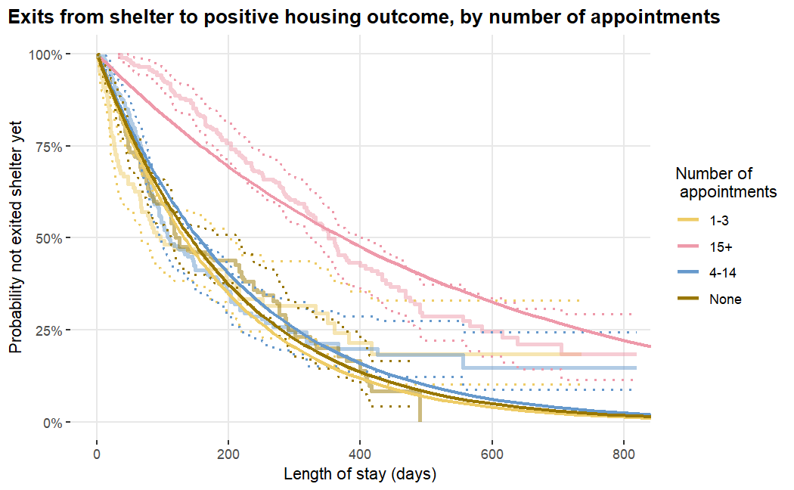
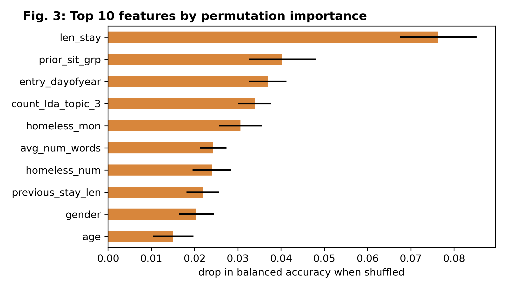

## Abstract

  Problem: Church at the Park (C\@P) provides vital services to the local community, and generates data from multiple locations to provide those services, but does not have their data sources integrated. This lack of integration makes it difficult for C\@P to analyze their data to gain insight into what factors drive positive outcomes. Through this work we hoped to help C\@P's staff better understand their program outcomes and advocate for increased resources that will lead to more community benefit.

  We integrated three different C\@P data sources, and investigated factors associated with the wait time to enter shelter, and how long it takes to exit shelter. To accomplish this, we used statistical analysis methods that examine duration of time until certain events occur, and built a machine learning model aimed at predicting outcomes of applications and exits to shelter.

  With our duration analysis and machine learning models, we identified a variety of variables that are associated with the time to enter or exit shelter. These variables tended to fall into two groups: specific circumstances or traits of a participant, and engagement with case management.

  Based on our exploration of the data and our discussions with C\@P, we also found that real world circumstances that are not captured in C\@P's data may also affect the results and interpretation. Of particular note, we found that the volume of applications for shelter significantly outpaces the availability of shelter. Only 14% of applications could ultimately be matched to a stay with C\@P, showing that there is a significant need for shelter in the Salem area community. Additionally, we identified a variety of opportunities where C\@P may want to invest resources to improve outcomes or adjust processes to improve data collection for future analysis.

## Ethics notice

We used data provided by C@P, with their consent. Prior to accessing data, team members filled out applications to serve as volunteers and consented to C@P performing background checks. More information on our ethical considerations and efforts to address data privacy, fairness, and equity can be found in our full write up. 

## Data Sources

Our data came from three sources, all provided by C\@P, for activity 2024-2025. As summary of our data sources is included below.

+----------------------------------------------------------------------------+-------------+-----------+------------------------------------------------------------+
| Source                                                                     | Volume      | Coverage  | Access
+:===========================================================================+:============+:==========+:===========================================================+
| Application data (From Cognito)                                            | 6604 rows   | 2024-2025 | Provided by C\@P, a one time manual pull completed by C\@P |
+----------------------------------------------------------------------------+-------------+-----------+------------------------------------------------------------+
| Case management data (From Activate Care)                                  | 20,930 rows | 2024-2025 | Provided by C\@P, a one time manual pull completed by C\@P |
+----------------------------------------------------------------------------+-------------+-----------+------------------------------------------------------------+
| Federal reporting data (From WellSky, HMIS)                                | 1,347 rows  | 2024-2025 | Provided by C\@P, a one time manual pull completed by C\@P |
+----------------------------------------------------------------------------+-------------+-----------+------------------------------------------------------------+

**Engineering summary**

  Due to the confidentiality of the data and technical limitations in setting up access to it, our data pipeline required manual extraction and transformation. Our pipeline consisted of three major steps: (1) Manually extract data from C\@P's three systems (C\@P staff assisted with obtaining these extracts), (2) Manually cleaning, wrangling, and redacting confidential information in C\@P's SharePoint, and (3) Exporting cleaned data to our GitHub repository. We then used Python and R scripts to analyze the data in GitHub and produce our deliverables.

  

  One major limitation we discovered during step 2 of this process was the limited availability of matchable data points between the Applications data and the HMIS data. As such, we were only able to match a fraction of the total HMIS stays to their corresponding application. Additionally, this manually process was exacerbated by not having more powerful analysis tools to automatically find and evaluate potential duplicates en masse. This work could be greatly sped up by introducing some back-filling of the HMIS Record IDs to the applications data once an applicant has been approved for and moved into emergency shelter.

## Primary Methods

**Duration Analysis**

  Survival analysis is a statistical method that specifically examines how long it takes for an event to occur and helps scientists develop estimates for when an event will occur. Often, survival analysis is used in medical or industrial research. For our purposes, we are using this method to examine how long participants take to enter and exit shelter, and explore which variables modify the time it takes to enter or exit. In this write up, going forward, we will refer to survival analysis as a duration analysis, as we felt duration is more descriptive of the analysis we were doing, and more appropriate considering the focus of our project.

**Machine Learning (XGBoost)**

  Machine learning algorithms help uncover patterns in data and can be used to develop models to predict specific results (for example, whether a customer will churn, or how long they will take to churn.) We opted to use machine learning to predict the status of a participant's application (successful, returned, or unsuccessful), and what kind of outcome a participant exited to, once they left shelter. We specifically chose to use the XGBoost library, which uses multiple decision trees as the basis of its machine learning model. We used this method because it supports missing values without the need for imputation. We often found missingness throughout our data, so XGBoost was a good fit, especially given that the missingness may simply be because the participant was not required to answer every question in full.

## Key Results

The following are brief highlights of our primary findings. However, we encourage reviewing the full write up for a complete discussion of how we interpret these results and the real world context that may affect them. 

### Factors associated with time to get into shelter, or length of stay in shelter

We found notable differences in time spent in or waiting for shelter, depending on:

  ● Shelter location

  ● Whether the participant has health coverage (stays only)

  ● Gender

  ● Age

The figure below shows how length of stay before exiting to a positive outcome tends to be longer for the Polk County and Village of Hope sites
compared to others.

  

Additionally, our data sources include case management notes that summarize assistance participants were receiving from a case manager. We found multiple variables where more engagement appears associated with longer stays in
shelter. Those factors included:

  ● Mentions of various key words: “Appointment”, “Medication”, “Identification” and “Benefits.”

  ● Length of appointments
  
We found that these interactions could ultimately be generalized to an “Engagement” metric, which we identified as the total number of appointments. See the figure below to see how time spent in shelter varies depending on how many appointments a participant had. 

  

### Factors associated with positive exits from shelter programs

● Longer stays are positively associated with a positive exit, while shorter stays range from neutral to strongly negative.

● Participants coming from a ‘place not meant for habitation’ were more likely to have a negative exit.

● Entry in the 2nd half of the year 2024/2025) is predictive of a positive exit.

● LDA Topic 3 relates to noncompliance with site rules, and is negatively associated with a positive exit.

  

## Findings

With our duration analysis and machine learning model, we identified a variety of variables that are associated with the time to enter or exit shelter. These variables tended to fall into two groups: specific circumstances or traits of a participant, and engagement with case management. However, based on our our exploration of the data and our discussions with C\@P, we also found that real world circumstances that are not captured in C\@P’s data may also affect the results and interpretation.

## The Full Write-Up

[Download the write-up (PDF)](assets/writeup.pdf){.btn .btn-primary}

